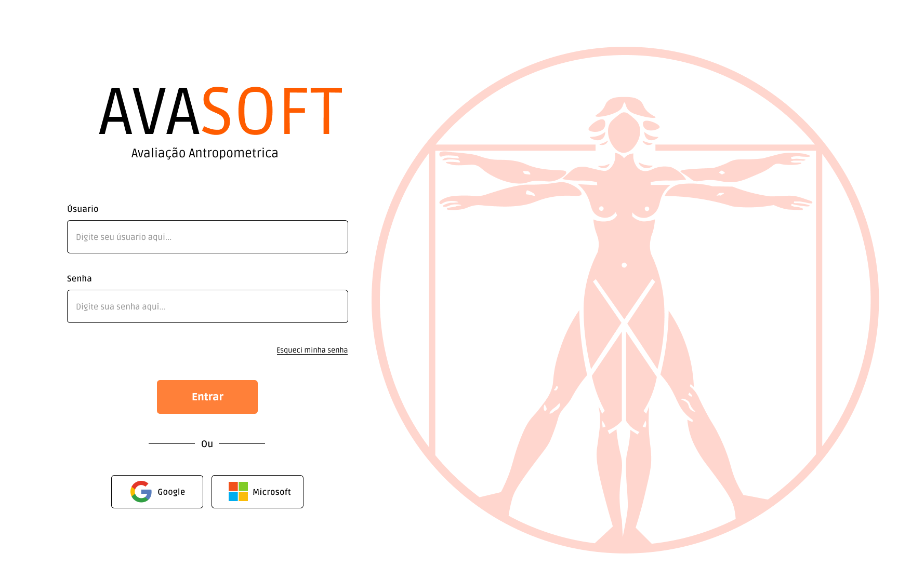
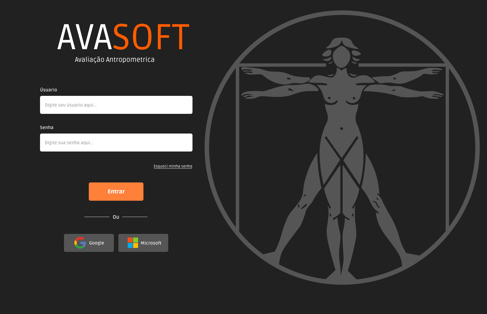
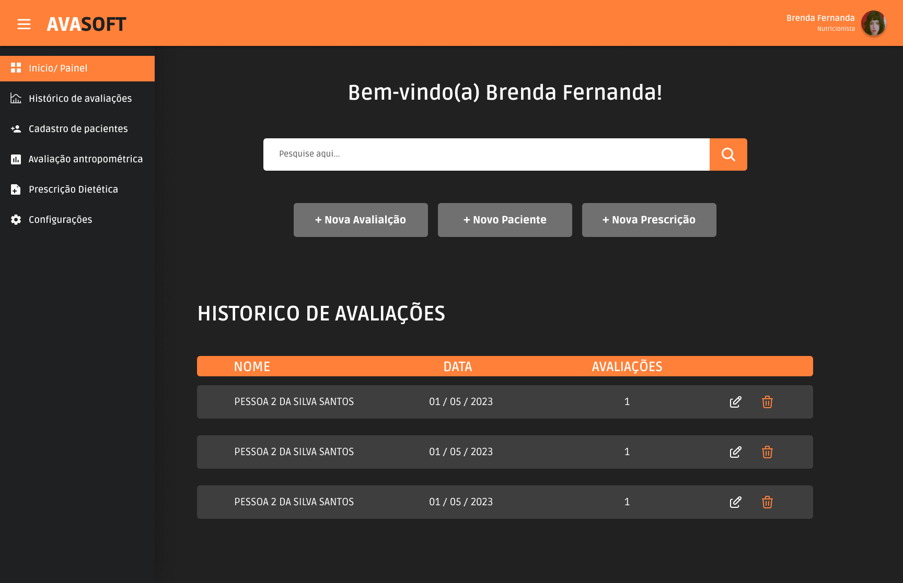

<h1 align="center"> 
Sistema de Avaliação Antropométrica - AVASOFT </h1>

# 📚 Sobre
O sistema Avasoft tem como objetivo auxiliar no processo das avaliações antropométricas, coletando e armazenando dados por um período de tempo, fornecendo um resultado comparativo dos dados sobre a evolução dos alunos ao longo do tempo,com auxílio de gráficos para a visualização dos resultados.

## 📑Resumo
Este projeto visa aprimorar as avaliações antropométricas feitas por um profissional nutricionista curso de educação física da UFAC. Atualmente, as avaliações são feitas manualmente em formulários impressos, resultando em possíveis erros e dificuldades no armazenamento de dados. O software proposto eliminará o uso de papel, simplificando o processo de coleta e armazenamento de dados, além de fornecer resultados comparativos e gráficos. A análise de viabilidade técnica, econômica e legal mostrou que o desenvolvimento é factível, contando com a expertise da equipe e recursos disponíveis.

## 🖥️🛠️ Tecnologias e Ferramentas utilizadas

|   **BACKEND**   |   **FRONTEND**  |   **FERRAMENTAS**  |
| :---------: | :---------: | :------------: |
|  JavaScript |    Vue JS   |     Figma      |
|   Node JS   | Electron JS |    Trello      |
|  Sequelize  | HTML E CSS  |    GitHub      |
|  Postgresql |  Tailwind   |    VsCode      |

 

## 🚀  Funcionalidades, recursos do sistema
#### 🚩	 Cadastro de Pacientes
- Necessidade: Registrar informações essenciais dos pacientes.
- Classificação: Essencial
  
#### 🚩		 Registro de Medidas Antropométricas
- Necessidade: Armazenar dados precisos das medidas corporais para cálculos futuros.
- Classificação: Essencial

#### 🚩		 Cálculos Automatizados
- Necessidade: Realizar automaticamente cálculos antropométricos.
- Classificação: Essencial

#### 🚩		 Geração de Relatórios
- Necessidade: Criar relatórios personalizados e abrangentes.
- Classificação: Importante

#### 🚩		 Visualização Gráfica
- Necessidade: Apresentar visualizações gráficas das medidas, como dashboards.
- Classificação: Desejável

## 📸 Protótipos Figma
### Tela Login White/ black

  
  

### Tela Home

  

## 🔄	Atualizações no sistema
  &nbsp; &nbsp; ✅ Necessidade: Registrar informações essenciais dos pacientes. 
  &nbsp; &nbsp; ❌ Necessidade: Armazenar dados precisos das medidas corporais para cálculos futuros. 
  &nbsp; &nbsp; ❌ Necessidade: Realizar automaticamente cálculos antropométricos. 
  &nbsp; &nbsp; ❌ Necessidade: Criar relatórios personalizados e abrangentes. 
  &nbsp; &nbsp; ❌ Necessidade: Apresentar visualizações gráficas das medidas, como dashboards. 

## 💡🐛 Issues
### ❓ Encontrou algum problema ou tem alguma ideia para melhorar o projeto? 
💡 Fique à vontade para abrir uma issue e contribuir com o desenvolvimento! Siga as diretrizes abaixo:

1. **Problemas**: Ao relatar um problema, forneça o máximo de detalhes possível, incluindo os passos para reproduzir o problema.
2. **Melhorias**: Para sugestões de melhorias, descreva claramente sua ideia e, se possível, forneça exemplos ou contexto adicional.

Vamos trabalhar juntos para tornar este projeto ainda melhor! 

## 👩‍💻💼 Time de Desenvolvimento

 |  Ana Caroline |    Anderson Dantas   |
 | :---------: | :---------: |
 |      |    |
 |    Backend    |        Frontend    |

